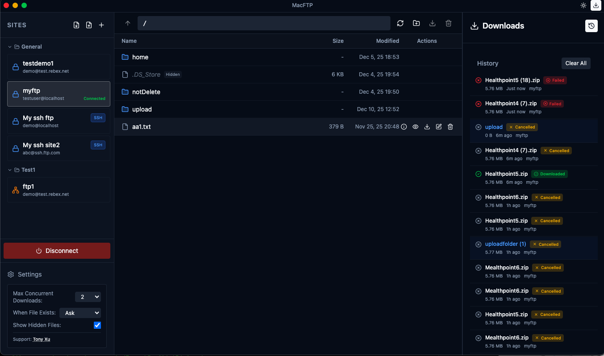

# MacFTP

A modern, native-feeling FTP/SFTP client for macOS, built with Electron, React, and TypeScript.



[](https://opensource.org/licenses/MIT)
[](https://github.com/fihtony/macFTP)

## Summary

MacFTP is a desktop application that provides a secure and user-friendly way to manage FTP and SFTP connections. It features a modern macOS-native interface with support for multiple connection profiles, encrypted credential storage, file browsing, downloads, uploads, and file previews. All sensitive data is encrypted using industry-standard AES-256 encryption and stored securely on your local machine.

## Features

### 🔐 Security & Data Protection
- **Encrypted Storage**: All sensitive credentials (hosts, usernames, passwords, SSH keys) are encrypted using AES-256-CBC encryption
- **Secure Key Management**: Encryption keys are derived using PBKDF2 and stored securely in macOS Keychain
- **Local Storage**: All data is stored locally on your machine - no cloud sync, no external servers
- **Multiple Protocols**: Support for both FTP and SFTP (SSH) with key-based authentication

### 📁 Site Management
- Save and manage multiple FTP/SFTP connection profiles
- Organize sites by groups with collapsible sections
- Set initial paths for automatic navigation after connection
- Visual connection progress indicators

### 🔍 File Browser
- Browse remote file systems with an intuitive interface
- Address bar with autocomplete suggestions
- File details view (size, permissions, dates, owner)
- Multiple navigation methods (click, breadcrumbs, buttons)

### 📥 Download Management
- Queue multiple downloads with progress tracking
- Real-time progress with speed and ETA
- Download history that persists across app restarts
- Conflict resolution: overwrite, rename, skip
- Background download support

### 📤 Upload Management
- Drag & drop file and folder uploads
- Upload progress tracking with speed and ETA
- Conflict resolution (overwrite, rename, skip) with "apply to all" option
- Support for single files, multiple files, folders, and mixed uploads

### 👁️ File Preview
- Text file preview with syntax highlighting and search
- Image preview with zoom controls
- Automatic cleanup of temporary preview files

### 🎨 User Interface
- Modern macOS design with custom title bar
- Dark/Light mode toggle
- Resizable panels for optimal workspace layout
- Toast notifications for user feedback

## Installation

### Prerequisites
- macOS (tested on macOS 10.15+)
- Node.js v16 or higher
- npm

### Build from Source

1. Clone the repository:
   ```bash
   git clone https://github.com/fihtony/macFTP.git
   cd macFTP
   ```

2. Install dependencies:
   ```bash
   npm install
   ```

3. Build the application:
   ```bash
   npm run build
   ```

4. Build for macOS distribution:
   ```bash
   # Build DMG installer
   npm run build:dmg
   
   # Or build ZIP archive
   npm run build:mac
   ```

The built application will be in the `release` directory.

## Development

### Running in Development Mode

```bash
npm run dev
```

This starts both the Electron app and Vite dev server with hot module replacement.

### Project Structure

```
macFTP/
├── src/
│   ├── main/                          # Electron main process (Node.js)
│   │   ├── main.ts                    # Entry point, window management
│   │   ├── preload.ts                 # IPC bridge between main and renderer
│   │   └── services/
│   │       ├── commonHandler.ts       # Common FTP/SFTP operations, duplicate resolution
│   │       ├── database.ts            # Encrypted data storage (electron-store)
│   │       ├── downloadFileHandler.ts # Single file download handling
│   │       ├── downloadFolderHandler.ts # Folder download handling
│   │       ├── encryption.ts          # AES-256 encryption utilities
│   │       ├── ftpHandlers.ts         # FTP/SFTP connection and file operations
│   │       ├── uploadFileHandler.ts   # Single file upload handling
│   │       └── uploadFolderHandler.ts # Folder upload handling
│   ├── renderer/                      # React frontend
│   │   ├── App.tsx                    # Main application component
│   │   ├── main.tsx                   # React entry point
│   │   ├── index.css                  # Global styles and theme variables
│   │   ├── store.ts                   # Zustand state management
│   │   ├── utils.ts                   # Utility functions
│   │   ├── components/                # UI components
│   │   │   ├── FileExplorer.tsx       # Main file browser
│   │   │   ├── Sidebar.tsx            # Site manager sidebar
│   │   │   ├── TitleBar.tsx           # Custom title bar
│   │   │   ├── DownloadManager.tsx    # Download queue and history
│   │   │   ├── UploadProgressDialog.tsx # Upload progress dialog
│   │   │   ├── DownloadProgressDialog.tsx # Download progress dialog
│   │   │   ├── FilePreview.tsx        # File preview component
│   │   │   └── ...                    # Other dialog and UI components
│   │   ├── services/
│   │   │   └── UploadManager.ts       # Unified upload session management
│   │   ├── types/
│   │   │   └── upload.ts              # Upload-related type definitions
│   │   └── utils/
│   │       └── formatters.ts          # Date and size formatting utilities
│   └── shared/                        # Shared code between main and renderer
│       └── fileExtensions.ts          # File extension mappings
└── assets/
    └── icons/                         # Application icons
```

## Demo Servers

### Rebex Test Server (Recommended)
- **Host**: `test.rebex.net`
- **Port**: `21` (FTP) or `22` (SFTP)
- **Username**: `demo`
- **Password**: `password`
- **Note**: Read-only server for testing

## License

MIT License

Copyright (c) 2025 Tony Xu

See [LICENSE](LICENSE) file for details.

## Author

**Tony Xu**
- Email: fihtony@gmail.com
- GitHub: [@fihtony](https://github.com/fihtony)
- Repository: [https://github.com/fihtony/macFTP](https://github.com/fihtony/macFTP)
