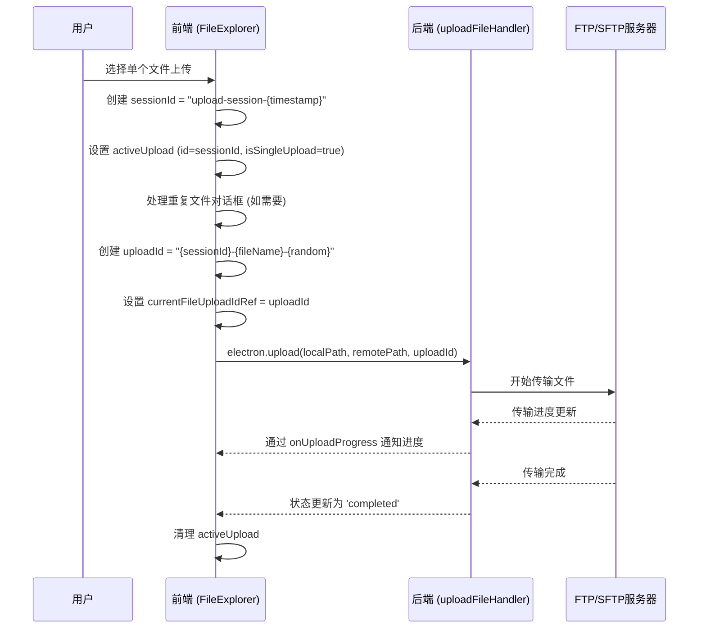
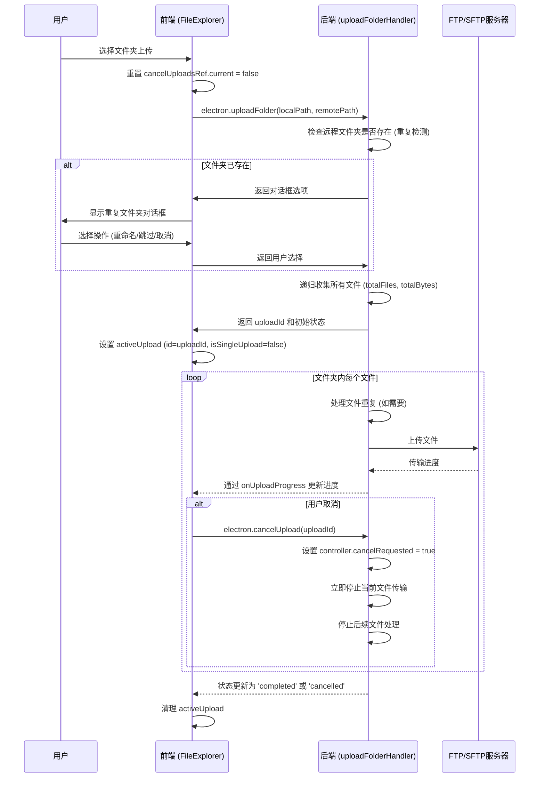
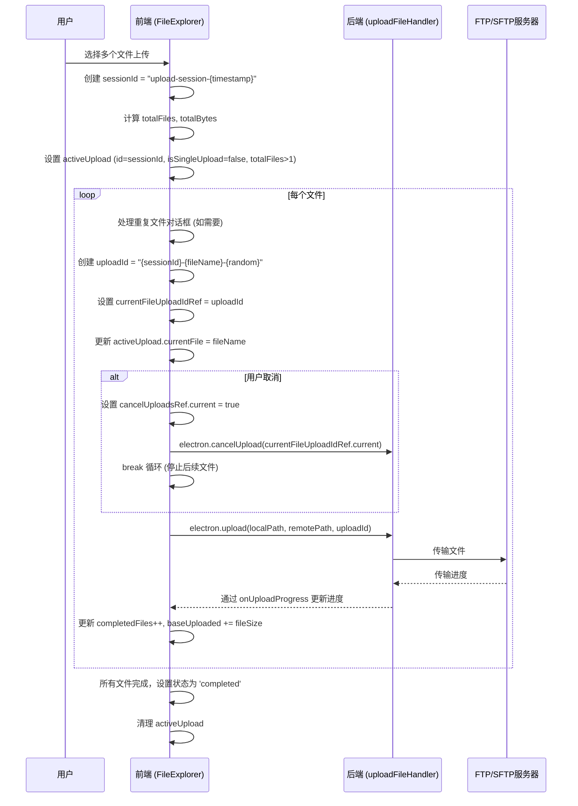
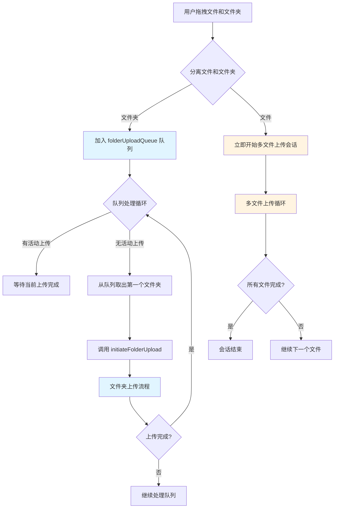
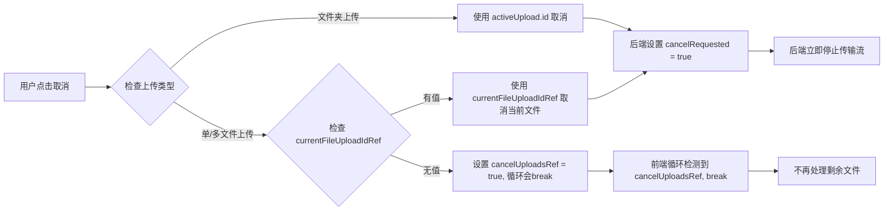

# 上传会话管理机制说明

## 概述

系统支持四种上传类型，每种类型使用不同的会话管理策略：

1. **单文件上传** (Single File Upload)
2. **文件夹上传** (Folder Upload)
3. **多文件上传** (Multiple Files Upload)
4. **混合上传** (Mixed Files + Folders Upload)

---

## 1. 单文件上传 (Single File Upload)

### 特点
- 用户选择一个文件进行上传
- 使用**会话ID** (`upload-session-{timestamp}`) 作为主标识
- 为实际文件传输创建**文件上传ID** (`{sessionId}-{fileName}-{random}`)

### 流程



### 示例

**场景**: 上传文件 `document.pdf` (5MB)

```
1. 创建会话:
   - sessionId = "upload-session-1765038755452"
   - activeUpload.id = "upload-session-1765038755452"
   - activeUpload.isSingleUpload = true

2. 处理重复文件 (如果需要):
   - 显示对话框让用户选择: 覆盖/重命名/跳过

3. 创建文件上传ID:
   - uploadId = "upload-session-1765038755452-document.pdf-r6v8"
   - currentFileUploadIdRef.current = uploadId

4. 开始上传:
   - 调用 electron.upload()，使用 uploadId
   - 后端使用 uploadId 注册上传控制器

5. 取消上传:
   - 用户点击取消 → 使用 currentFileUploadIdRef.current (即 uploadId)
   - 后端立即停止传输流
```

---

## 2. 文件夹上传 (Folder Upload)

### 特点
- 用户选择一个文件夹进行上传
- 使用**单一上传ID** (`upload-{timestamp}-{random}`) 管理整个文件夹
- 后端负责递归遍历文件夹内的所有文件
- 前端只接收整体进度更新

### 流程



### 示例

**场景**: 上传文件夹 `project/`，包含以下结构：
```
project/
├── src/
│   ├── main.js (2MB)
│   └── utils.js (1MB)
└── README.md (100KB)
```

```
1. 创建上传会话:
   - uploadId = "upload-1765038741962-4d8agq"
   - activeUpload.id = "upload-1765038741962-4d8agq"
   - activeUpload.isSingleUpload = false

2. 后端处理:
   - 收集所有文件: totalFiles = 3, totalBytes = 3.1MB
   - 递归上传每个文件
   - 每个文件上传时，更新:
     * currentFile = "src/main.js"
     * currentFileSize = 2MB
     * currentFileUploaded = 0 → 2MB
     * uploadedBytes = 0 → 2MB → 3MB → 3.1MB
     * completedFiles = 0 → 1 → 2 → 3

3. 取消上传:
   - 用户点击取消 → 使用 activeUpload.id (即 uploadId)
   - 后端检测到 cancelRequested，立即停止当前文件传输
   - 不再处理剩余文件
```

---

## 3. 多文件上传 (Multiple Files Upload)

### 特点
- 用户选择多个文件（非文件夹）进行上传
- 使用**会话ID** (`upload-session-{timestamp}`) 作为主标识
- 前端循环处理每个文件，为每个文件创建**独立的文件上传ID**
- 前端管理整体进度（总文件数、总字节数、已完成文件数）

### 流程



### 示例

**场景**: 同时上传 3 个文件
- `file1.txt` (1MB)
- `file2.txt` (2MB)
- `file3.txt` (3MB)

```
1. 创建会话:
   - sessionId = "upload-session-1765038679205"
   - activeUpload.id = "upload-session-1765038679205"
   - activeUpload.isSingleUpload = false (因为 totalFiles > 1)
   - activeUpload.totalFiles = 3
   - activeUpload.totalBytes = 6MB

2. 循环处理每个文件:

   文件1: file1.txt
   - uploadId1 = "upload-session-1765038679205-file1.txt-yo4v"
   - currentFileUploadIdRef.current = uploadId1
   - activeUpload.currentFile = "file1.txt"
   - 上传完成后: completedFiles = 1, uploadedBytes = 1MB

   文件2: file2.txt
   - uploadId2 = "upload-session-1765038679205-file2.txt-abc1"
   - currentFileUploadIdRef.current = uploadId2
   - activeUpload.currentFile = "file2.txt"
   - 上传完成后: completedFiles = 2, uploadedBytes = 3MB

   文件3: file3.txt
   - uploadId3 = "upload-session-1765038679205-file3.txt-xyz2"
   - currentFileUploadIdRef.current = uploadId3
   - activeUpload.currentFile = "file3.txt"
   - 上传完成后: completedFiles = 3, uploadedBytes = 6MB

3. 取消上传 (例如在文件2上传时取消):
   - 用户点击取消
   - cancelUploadsRef.current = true
   - 使用 currentFileUploadIdRef.current (uploadId2) 取消当前文件
   - break 循环，不再处理文件3
   - 最终状态: completedFiles = 1, uploadedBytes = 1MB, status = 'cancelled'
```

---

## 4. 混合上传 (Mixed Files + Folders Upload)

### 特点
- 用户同时选择文件和文件夹进行上传
- **文件夹**被加入队列 (`folderUploadQueue`)，逐个处理
- **文件**立即开始上传，使用多文件上传机制
- 两种类型可以同时进行（如果允许并发）

### 流程



### 示例

**场景**: 用户同时拖拽
- 文件夹: `project/` (包含 2 个文件)
- 文件: `readme.txt`, `license.txt`

```
1. 分离处理:
   - 文件夹: project/ → 加入 folderUploadQueue
   - 文件: readme.txt, license.txt → 立即开始上传

2. 文件上传会话 (立即开始):
   - sessionId = "upload-session-1765039000000"
   - activeUpload.id = "upload-session-1765039000000"
   - activeUpload.isSingleUpload = false
   - activeUpload.totalFiles = 2
   - 循环上传 readme.txt 和 license.txt

3. 文件夹上传队列 (等待文件上传完成):
   - folderUploadQueue = [{ folderName: "project", ... }]
   - 当 activeUpload 为 null 时，开始处理队列
   - 创建新的上传会话:
     * uploadId = "upload-1765039100000-xyz"
     * activeUpload.id = "upload-1765039100000-xyz"
     * activeUpload.isSingleUpload = false
   - 后端递归上传文件夹内的所有文件

4. 关键点:
   - 文件和文件夹使用不同的上传ID系统
   - 文件夹上传不会与文件上传并发（通过 activeUpload 检查）
   - 每个文件夹上传是独立的会话
```

---

## 关键数据结构

### UploadTaskState (前端状态)

```typescript
{
  id: string;                    // 会话ID (单/多文件) 或 上传ID (文件夹)
  status: 'starting' | 'uploading' | 'completed' | 'cancelled' | 'failed';
  uploadedBytes: number;         // 已上传总字节数
  totalBytes: number;             // 总字节数
  completedFiles: number;          // 已完成文件数
  totalFiles: number;             // 总文件数
  currentFile?: string;           // 当前正在上传的文件名
  currentFileUploaded?: number;   // 当前文件已上传字节数
  currentFileSize?: number;       // 当前文件大小
  isSingleUpload?: boolean;       // true=单文件, false=多文件/文件夹
  cancelRequested?: boolean;      // 是否已请求取消
  // ... 其他字段
}
```

### ID 系统

| 上传类型 | activeUpload.id | currentFileUploadIdRef | 后端注册ID |
|---------|----------------|----------------------|-----------|
| 单文件 | `upload-session-{ts}` | `{sessionId}-{fileName}-{random}` | `currentFileUploadIdRef` |
| 多文件 | `upload-session-{ts}` | `{sessionId}-{fileName}-{random}` (每个文件) | `currentFileUploadIdRef` |
| 文件夹 | `upload-{ts}-{random}` | 不使用 | `activeUpload.id` |

---

## 取消机制

### 取消流程



### 取消时机检查点

1. **循环开始前**: `if (cancelUploadsRef.current) break;`
2. **重复文件对话框后**: 检查是否在对话框期间被取消
3. **上传开始前**: 再次检查，确保及时停止
4. **上传进行中**: 后端数据流中检查 `controller.cancelRequested`
5. **上传完成后**: 检查是否应该停止处理后续文件

---

## 复杂场景示例

### 场景: 取消多文件上传中的第一个文件

**初始状态**:
- 3 个文件待上传: file1.txt, file2.txt, file3.txt
- 当前正在上传 file1.txt

**用户操作**: 在 file1.txt 上传到 50% 时点击取消

**执行流程**:

```
1. 前端处理:
   - handleCancelUpload() 被调用
   - cancelUploadsRef.current = true
   - activeUpload.cancelRequested = true
   - currentFileUploadIdRef.current = "upload-session-xxx-file1.txt-abc"
   - 调用 electron.cancelUpload("upload-session-xxx-file1.txt-abc")

2. 后端处理:
   - upload:cancel 处理器收到请求
   - 找到对应的 UploadController
   - controller.cancelRequested = true
   - 在数据流的 'data' 事件中检测到取消
   - 立即销毁传输流
   - 返回取消确认

3. 前端继续:
   - onUploadProgress 收到 'cancelled' 状态
   - 更新 activeUpload.status = 'cancelled'
   - 循环检测到 cancelUploadsRef.current = true
   - break 循环，不再处理 file2.txt 和 file3.txt
   - 显示 "Upload cancelled" 提示
   - 清理 activeUpload
```

---

## 总结

### 设计原则

1. **ID 分离**: 会话ID用于前端状态管理，文件上传ID用于后端传输控制
2. **状态同步**: 通过 `onUploadProgress` 事件保持前后端状态一致
3. **取消及时性**: 多个检查点确保取消请求能立即生效
4. **类型区分**: `isSingleUpload` 标志区分单文件和多文件/文件夹上传
5. **队列管理**: 文件夹上传使用队列，避免与文件上传冲突

### 关键变量

- `activeUpload`: 当前活动的上传状态（前端）
- `currentFileUploadIdRef`: 当前正在传输的文件的上传ID（前端引用）
- `cancelUploadsRef`: 取消标志（前端引用，用于循环控制）
- `folderUploadQueue`: 文件夹上传队列（前端状态）

